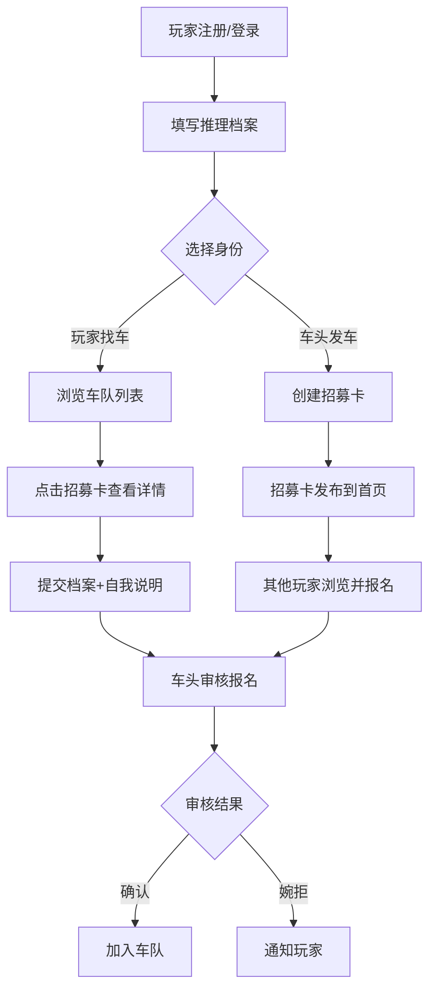

## 1. 产品概述

面向硬核推理剧本杀玩家的移动端车队招募工具，解决"想打高难本却怕队友不在一个频道"的痛点。通过玩家推理档案、车队招募卡和报名筛选三大核心功能，让个人车头能够快速组建高质量推理车队，告别低效拼车和雷点冲突。

- 目标用户：有高难本经验的硬核推理玩家、临时组队的车头
- 核心价值：精准匹配推理风格，杜绝雷点冲突，提升组队效率与游戏体验

## 2. 核心功能

### 2.1 用户角色

| 角色 | 说明 | 核心权限 |
|------|------|----------|
| 玩家 | 所有注册用户 | 填写档案、浏览车队、报名参加 |
| 车头 | 发起招募的玩家 | 创建招募卡、审核报名、确认/婉拒成员 |

### 2.2 功能模块

1. **首页车队列表**：展示所有进行中的招募车队，支持按难度/时间/类型筛选，快捷发车入口
2. **招募详情页**：查看车队完整信息、报名提交、车头审核报名者
3. **个人档案页**：编辑推理档案、查看已报名车队、管理自己发起的车队

### 2.3 页面详情

| 页面名称 | 模块名称 | 功能描述 |
|----------|----------|----------|
| 首页车队列表 | 顶部导航栏 | 应用标题"拼车局"、筛选按钮、发车按钮 |
| 首页车队列表 | 筛选面板 | 按难度（进阶/烧脑/地狱）、剧本类型（硬核推理/机制阵营/还原推凶）、时间范围筛选 |
| 首页车队列表 | 车队卡片列表 | 展示剧本名、难度标签、缺位人数、开车时间、店铺、车头昵称 |
| 首页车队列表 | 空状态 | 无车队时的引导文案和发车按钮 |
| 招募详情页 | 招募信息区 | 剧本名称、难度、人数、店铺、开车时间、角色缺位、车头要求（读本快/接受跳车替补） |
| 招募详情页 | 已报名列表（车头视角） | 展示报名者档案摘要和自我说明，逐个确认/婉拒 |
| 招募详情页 | 报名区（玩家视角） | 一键提交档案+自我说明输入框 |
| 招募详情页 | 招募状态 | 已满员/招募中/已截止状态展示 |
| 个人档案页 | 档案编辑表单 | 常玩本型、可接受时长、是否愿意做笔记、复盘习惯、雷点标签 |
| 个人档案页 | 档案卡预览 | 生成简洁的推理档案卡展示 |
| 个人档案页 | 我的车队 | 已报名车队列表、我发起的车队列表 |

## 3. 核心流程

**玩家建档流程**：打开应用 → 进入个人档案页 → 填写推理偏好（常玩本型、时长、笔记、复盘、雷点）→ 系统生成推理档案卡

**车头发车流程**：点击发车 → 填写招募信息（剧本名、人数、店铺、时间、难度、缺位角色、要求）→ 发布招募卡 → 出现在首页列表

**报名筛选流程**：玩家浏览车队列表 → 点进招募详情 → 提交档案+自我说明 → 车头在详情页查看报名者 → 按硬核经验/时间匹配/雷点冲突逐个确认或婉拒

## 4. 用户界面设计

### 4.1 设计风格

- **整体风格**：暗黑侦探 Noir 风格——深邃黑底搭配琥珀金/暗红点缀，营造悬疑推理氛围
- **主色**：深炭黑 (#0D0D0F)，次色：暗灰 (#1A1A2E)
- **强调色**：琥珀金 (#D4A843)，暗红 (#8B2500)
- **辅助色**：烟雾灰 (#6B6B7B)，冷白 (#E8E6E1)
- **按钮风格**：圆角微凸，琥珀金主按钮，烟雾灰次要按钮，暗红危险操作
- **字体**：标题使用 Playfair Display（衬线侦探风），正文使用 Noto Sans SC（清晰中文）
- **布局风格**：移动端卡片流，顶部固定导航，底部浮动操作按钮
- **图标/装饰**：lucide-react 图标库 + 指纹/墨迹纹理装饰

### 4.2 页面设计概览

| 页面名称 | 模块名称 | UI 元素 |
|----------|----------|---------|
| 首页车队列表 | 顶部导航栏 | 深色毛玻璃背景、琥珀金标题、筛选图标、发车FAB按钮 |
| 首页车队列表 | 筛选面板 | 底部滑出面板、标签多选、琥珀金选中态 |
| 首页车队列表 | 车队卡片 | 深灰卡片、左侧难度色条、剧本名粗体、标签胶囊、时间图标+文字 |
| 招募详情页 | 招募信息区 | 顶部大卡片、剧本名大字、难度徽章、信息网格布局 |
| 招募详情页 | 报名列表 | 横向档案卡滑动、确认/婉拒双按钮、渐变边框 |
| 招募详情页 | 报名区 | 底部固定、毛玻璃背景、自我说明输入框+提交按钮 |
| 个人档案页 | 档案编辑 | 分组表单、标签选择器、开关控件、预览切换 |
| 个人档案页 | 档案卡预览 | 居中卡片、指纹装饰、标签云、渐变边框 |
| 个人档案页 | 我的车队 | 双Tab切换、简化车队卡片、状态色标 |

### 4.3 响应式设计

- 移动优先设计（375px-428px 核心视口）
- 触控优化：按钮最小 44px 触控区域，卡片可滑动
- 平板适配：双列卡片布局

### 4.4 动效设计

- 页面切换：右滑进入、左滑退出
- 卡片交互：按压缩放、悬浮微浮
- 报名确认：琥珀金粒子扩散动效
- 标签选择：弹性缩放反馈
- 空状态：侦探剪影呼吸灯动效
