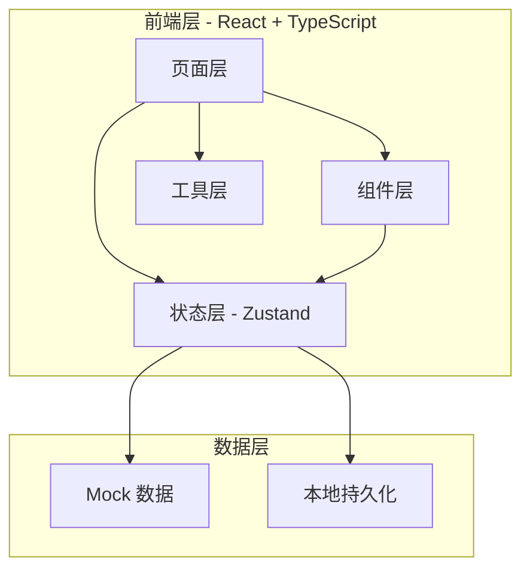
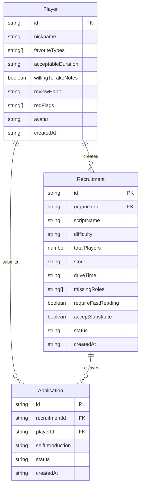

## 1. 架构设计



## 2. 技术说明

- 前端：React@18 + TypeScript + Tailwind CSS@3 + Vite
- 初始化工具：vite-init
- 后端：无（纯前端 + LocalStorage 持久化）
- 数据库：无（Mock 数据 + LocalStorage）
- 状态管理：Zustand（含 persist 中间件）
- 路由：react-router-dom@6
- 图标：lucide-react
- 字体：Google Fonts（Playfair Display + Noto Sans SC）

## 3. 路由定义

| 路由 | 用途 |
|------|------|
| / | 首页车队列表 |
| /recruit/:id | 招募详情页 |
| /profile | 个人档案页 |
| /profile/edit | 档案编辑页 |
| /create | 创建招募卡页 |

## 4. 数据模型

### 4.1 数据模型定义



### 4.2 数据定义

```typescript
interface Player {
  id: string;
  nickname: string;
  favoriteTypes: string[];
  acceptableDuration: string;
  willingToTakeNotes: boolean;
  reviewHabit: string;
  redFlags: string[];
  avatar: string;
  createdAt: string;
}

interface Recruitment {
  id: string;
  organizerId: string;
  scriptName: string;
  difficulty: "进阶" | "烧脑" | "地狱";
  totalPlayers: number;
  currentPlayers: number;
  store: string;
  driveTime: string;
  missingRoles: string[];
  requireFastReading: boolean;
  acceptSubstitute: boolean;
  description: string;
  status: "招募中" | "已满员" | "已截止";
  createdAt: string;
}

interface Application {
  id: string;
  recruitmentId: string;
  playerId: string;
  selfIntroduction: string;
  status: "待审核" | "已确认" | "已婉拒";
  createdAt: string;
}
```

## 5. 状态管理设计

```typescript
interface AppStore {
  currentPlayer: Player | null;
  recruitments: Recruitment[];
  applications: Application[];
  players: Player[];

  updateProfile: (player: Partial<Player>) => void;
  createRecruitment: (recruitment: Omit<Recruitment, "id" | "createdAt">) => void;
  updateRecruitmentStatus: (id: string, status: Recruitment["status"]) => void;
  submitApplication: (recruitmentId: string, selfIntroduction: string) => void;
  reviewApplication: (id: string, status: "已确认" | "已婉拒") => void;
  getRecruitmentById: (id: string) => Recruitment | undefined;
  getApplicationsByRecruitment: (recruitmentId: string) => Application[];
  getPlayerById: (id: string) => Player | undefined;
}
```
